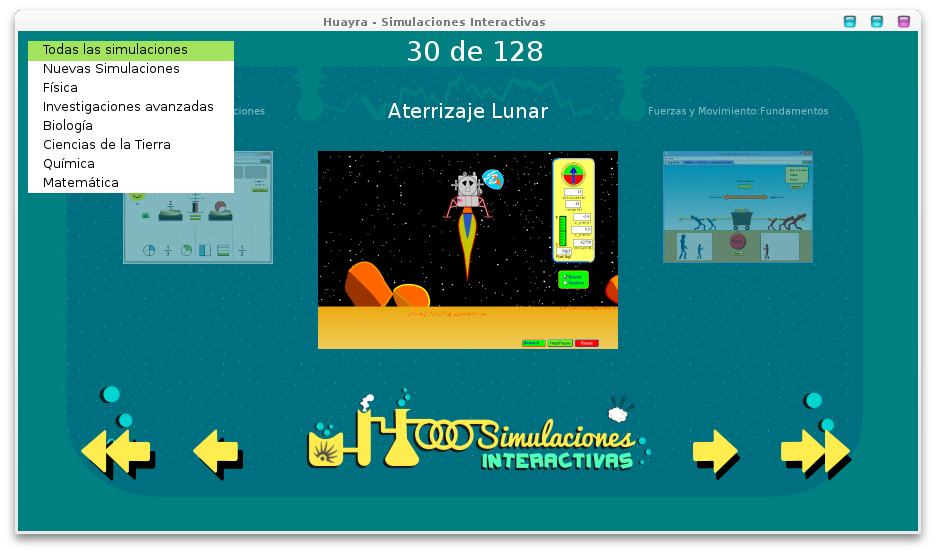
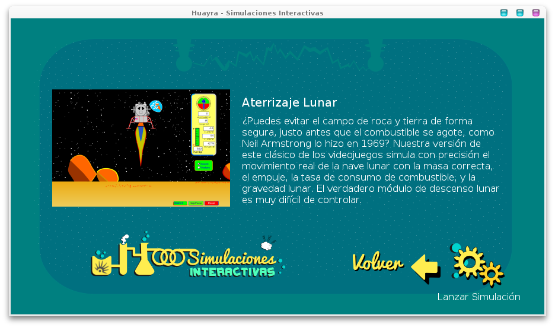
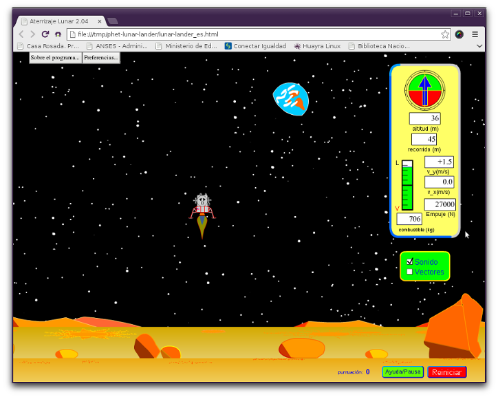

Huayra Simulaciones Interactivas
================================

Huayra Simulaciones Interactivas es un una aplicación que sirve para navegar a través de las simulaciones realizadas 
por el [PhET de la universidad de Colorado](http://phet.colorado.edu/)

Este software forma parte del proyecto [Huayra Gnu/Linux](http://huayra.conectarigualdad.gob.ar/), es software libre y
se distribuye instalado en las netbooks del [Programa Conectar Igualdad](http://conectarigualdad.gob.ar/) en Argentina.

###Capturas de Pantalla###

